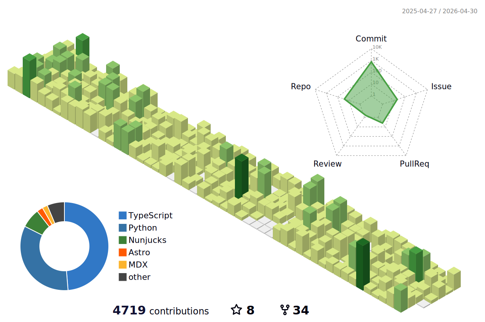

# Hi, I'm Le Viet Hong (he/him) 👋

Engineering leader with 20+ years of hands-on experience building scalable, reliable systems and growing high-performing teams from the ground up. I lead by example, whether it's debugging a tough production issue, architecting a new system, or mentoring an intern into a senior engineer. My focus is on operational excellence, product-driven engineering, and fostering a culture of clarity and ownership.

---

### 🌱 What I'm Currently Building

Right now, I'm pouring my energy into **[Locuno](https://github.com/Locuno)**, a community safety venture I founded to reduce emergency response times in dense urban areas through a verified neighbor network.

---

### 🛠️ My Core Toolkit

| Languages & Frameworks | Cloud & DevOps | Data & ML |
| :--- | :--- | :--- |
|  `Django`, `FastAPI` |  `GCP`, `Azure` |  `PyTorch` |
|  `Node.js`, `React` |  `Kubernetes` | `LightGBM`, `XGBoost` |
|  `Vite` |  `GitHub Actions` | `SQL`, `ETL` |
| `TDD`, `PyTest`, `Jest` | `Sentry`, `PostHog` | `Time-Series` |

---

### 📊 My GitHub Stats & Activity

  
  

  

### 🏙️ 3D Contribution Skyline

Experience my coding journey in 3D! These embedded visualizations show my contribution patterns as beautiful 3D landscapes, automatically updated daily.

  <picture>
    <source media="(prefers-color-scheme: dark)" srcset="./profile-3d-contrib/profile-night-rainbow.svg">
    <source media="(prefers-color-scheme: light)" srcset="./profile-3d-contrib/profile-green-animate.svg">
    
  </picture>

