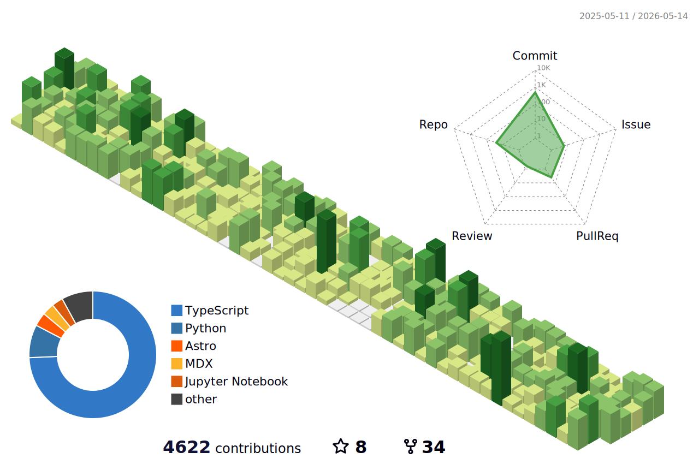

 

---

### Current focus

**[Open Problem Lab](https://github.com/Open-Problem-Lab/open-problem-lab)** — verification protocol for AI work on neglected global problems. 100+ problem packs across 11 domains. Machine-checkable schemas, structured review, domain expert gates. AI-agent-first — Cursor, Windsurf, Copilot, and Claude Code all auto-detect the canonical agent guide in the repo. Human review is non-negotiable. No claim becomes accepted knowledge without it.

---

### What I'm building

**[Lumi](https://runlumi.app/)** — AI workspace for business owners. Paste a Zalo thread, Excel note, or site update — Lumi turns the mess into the owner's morning brief: 3 decisions, 5 overdue items, 1 customer to close today. Who owes work, which customer needs a decision, what is late. No credit card. I maintain it end to end.

**[AGENTOWNERS](https://github.com/cschanhniem/AGENTOWNERS)** — CODEOWNERS for AI agents. Open-source policy layer that lets repository maintainers define what AI agents may do in issues, pull requests, reviews, labels, files, workflows, and repository automation.

**[What's This Mail?](https://whatsthismail.com/)** — Scan any piece of physical mail with your iPhone. On-device OCR reads it, plain-English summary tells you what it is, what to do, deadlines, and whether it's a scam — nothing uploaded, no account required. Free tier + Plus ($9.99/mo) + Family ($14.99/mo). iOS & Android.

**[LumiMail](https://github.com/cschanhniem/lumimail)** — Email that respects your attention. Self-hostable, privacy-first mail built on Cloudflare — no tracking pixels, no data mining, just clean delivery. I maintain it end to end.

**[ClawPing](https://github.com/cschanhniem/clawping)** — Your home server is behind CGNAT. No public IP. Uptime Kuma can't reach it. ClawPing flips the model: your server pings *out* to a Cloudflare Worker. 12 MB Go binary. Install and forget.

**[Locuno](https://locuno.com)** — Community safety platform I founded. Verified neighbor network that cuts emergency response times in dense urban areas. App, dashboard, CRM, blog — 8 repos, all in production.

**[ClawSeatbelt](https://github.com/cschanhniem/ClawSeatbelt)** — Local-first security for AI operators. Scores risky content, guards dangerous tool use, redacts sensitive transcripts. No cloud.

**[computestatecraft.com](https://github.com/cschanhniem/computestatecraft.com)** — Policy-grade maps and dossiers for AI, chips, capital, and geopolitics.

---

### What I've built across

<table>
<tr>
<td width="50%" valign="top">

**Quantitative trading**
Mispricing detection across venues. Stop-loss hunting analysis. Prediction market bots. Market making with Hummingbot. MetaTrader MQL5 strategies. DeFi arbitrage. Vietnamese & US market pipelines.

**Mobile**
Native iOS (Swift). Native Android (Kotlin). Cross-platform Flutter. All shipped to users.

</td>
<td width="50%" valign="top">

**AI & ML**
Agent harness optimization. LLM CLI → unified API proxy. Deep RL for text summarization. Stock prediction models. StyleGAN2. Text-to-video. NLP sentiment analysis.

**Infrastructure**
Cloudflare Workers. Docker/K8s. Terraform. GitHub Actions. OpenTelemetry. Outbound-only monitoring. Real-time dashboards.

</td>
</tr>
</table>

---

### Kaggle

| Writeup | Competition |
|---------|-------------|
| [RealityFlux](https://www.kaggle.com/competitions/banana/writeups/realityflux) | Banana |
| [Truth Boundary Lab v4](https://www.kaggle.com/competitions/kaggle-measuring-agi/writeups/truth-boundary-lab-v4-measuring-evidence-boundary) | Measuring AGI |
| [Triagegeist](https://www.kaggle.com/competitions/triagegeist/writeups/new-writeup-1774694360885) | Triagegeist |
| [BigQuery AI](https://www.kaggle.com/competitions/bigquery-ai-hackathon/writeups/new-writeup-1758474121977) | BigQuery AI Hackathon |
| [AGI StreamEntry](https://www.kaggle.com/code/fountainheadle/agi-streamentry) | Notebook |
| [Truth Boundary Lab v4 (Benchmark)](https://www.kaggle.com/benchmarks/fountainheadle/truth-boundary-lab-v4-evidence-boundary-awareness) | Benchmark |

---

### Languages I've shipped to production

### Frameworks & tools

### Cloud & infrastructure

---

### OSS I maintain or contribute to

<table>
<tr>
<td width="50%">

| | Project |
|---|---------|
| ★ | [lumimail](https://github.com/cschanhniem/lumimail) — privacy-first email (maintainer) |
| ★28 | [clawping](https://github.com/cschanhniem/clawping) — outbound monitoring |
| | [autogluon](https://github.com/cschanhniem/autogluon) — ML in 3 lines |
| | [opentelemetry-python-contrib](https://github.com/cschanhniem/opentelemetry-python-contrib) — OTel instrumentation |
| | [models](https://github.com/cschanhniem/models) — TensorFlow examples |
| | [vnpy](https://github.com/cschanhniem/vnpy) — quant trading framework |
| | [tf-quant-finance](https://github.com/cschanhniem/tf-quant-finance) — TF quant library |
| | [backtrader](https://github.com/cschanhniem/backtrader) — Python backtesting |

</td>
<td width="50%">

| | Project |
|---|---------|
| | [zipline](https://github.com/cschanhniem/zipline) — event-driven trading |
| | [ta-lib-python](https://github.com/cschanhniem/ta-lib-python) — technical analysis |
| | [pmdarima](https://github.com/cschanhniem/pmdarima) — ARIMA models |
| | [hurst](https://github.com/cschanhniem/hurst) — Hurst exponent |
| | [ChatDev](https://github.com/cschanhniem/ChatDev) — AI agent teams |
| | [Text2Video-Zero](https://github.com/cschanhniem/Text2Video-Zero) — text-to-video |
| | [EnvGuard](https://github.com/cschanhniem/EnvGuard) — env secret guard |

</td>
</tr>
</table>

---

 

 

 

 

<picture>
  <source media="(prefers-color-scheme: dark)" srcset="https://raw.githubusercontent.com/cschanhniem/cschanhniem/output/github-snake-dark.svg" />
  <source media="(prefers-color-scheme: light)" srcset="https://raw.githubusercontent.com/cschanhniem/cschanhniem/output/github-snake.svg" />
  
</picture>

 

<picture>
  <source media="(prefers-color-scheme: dark)" srcset="./profile-3d-contrib/profile-night-rainbow.svg">
  <source media="(prefers-color-scheme: light)" srcset="./profile-3d-contrib/profile-green-animate.svg">
  
</picture>

  

