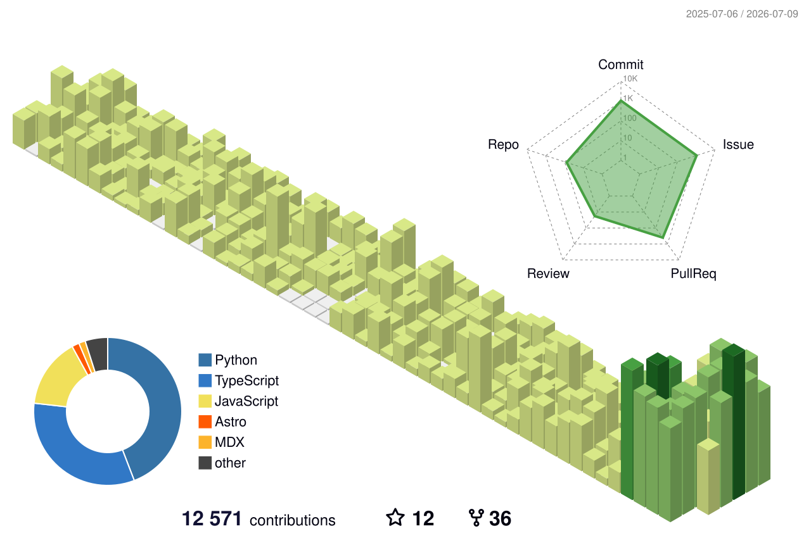

# Chánh Niệm

I build software for decisions where hand-waving is expensive: AI-assisted research, public markets, and small-business operations. 

[LinkedIn](https://www.linkedin.com/in/theaiarchitect/) · [Email](mailto:vh3969@gmail.com)

## Current focus

### [Toward Stream Entry Project](https://streamentry.github.io/streamentry/)

### [Kinh Tạng Pali](https://streamentry.github.io/kinh-tang-pali/)

### [Open Problem Lab](https://github.com/Open-Problem-Lab/open-problem-lab)

A GitHub-native verification protocol for work on neglected global problems. Canonical submissions expose their sources, methods, assumptions, limits, and failure modes. Schemas and CI enforce structure; human review and risk-based replication govern acceptance.

## Selected work

### [OpenAMP Foundry](https://github.com/Open-Problem-Lab/OpenAMP-Foundry)

A dry-lab pipeline for ranking antimicrobial peptide candidates. It combines transparent baselines, cluster-aware evaluation, computational safety screens, novelty checks, and auditable evidence certificates. Computation can prioritize experiments; it cannot establish biological activity, selectivity, or safety.

### [Mispricing Desk](https://mispricing-desk.4rqnf2gvxf.workers.dev/)

A public research desk tracking the gap between market narrative and primary evidence. The archive holds more than 500 notes; current screens focus on U.S. and Asian equities, using filings, company disclosures, and market data. Recent notes isolate one priced narrative and test it against one competing factor.

### [Lumi](https://runlumi.app/)

Lumi turns scattered team updates into a short daily brief for small-business owners: decisions waiting, overdue work, and risks that need attention. I build and operate its mobile, web, backend, and release systems.

### [ClawPing](https://github.com/cschanhniem/clawping)

ClawPing monitors home servers behind CGNAT. A static Go agent sends health checks outbound to a Cloudflare control plane, which tracks incidents and alerts through Telegram. It needs no inbound ports, dynamic DNS, or monitoring VPS.

## Stack

Python · TypeScript · Go · Kotlin · Swift · Cloudflare Workers · PostgreSQL

## Activity

<picture>
  <source media="(prefers-color-scheme: dark)" srcset="./profile-3d-contrib/profile-night-rainbow.svg">
  <source media="(prefers-color-scheme: light)" srcset="./profile-3d-contrib/profile-green-animate.svg">
  
</picture>
